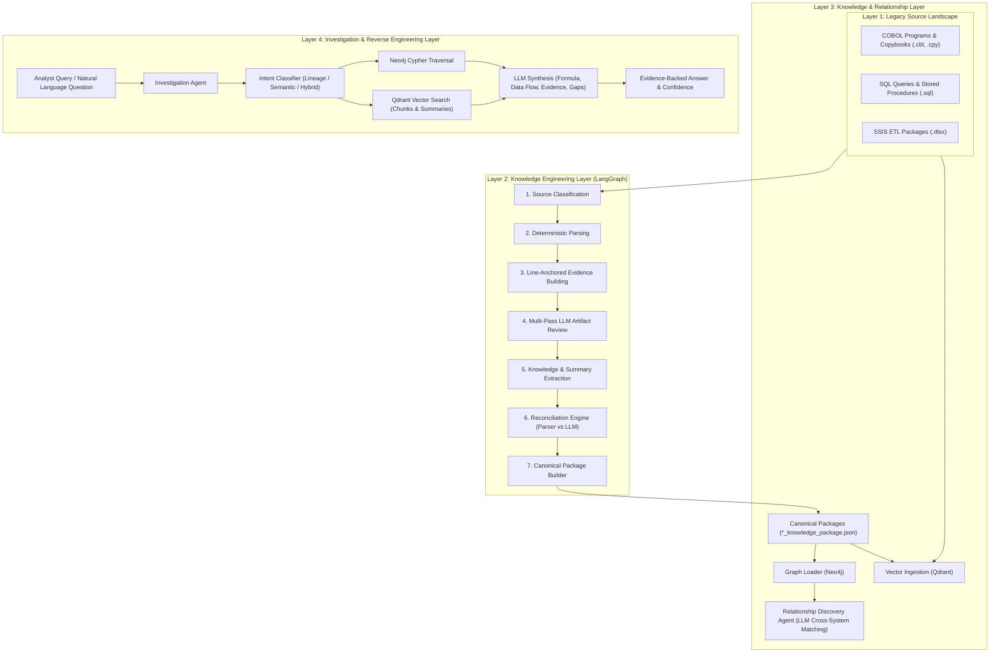

# 🌌 KAIRIX — Legacy Reverse Engineering Platform

KAIRIX is an AI-powered, multi-layered enterprise reverse engineering platform designed to analyze, extract, reconcile, and query complex legacy software landscapes (Mainframe COBOL, SQL scripts/stored procedures, and SSIS ETL packages).

---

## 🏛️ High-Level Architecture

KAIRIX follows a 4-layer architecture combining deterministic parsing, multi-pass LLM reasoning, graph traversal, and dense vector retrieval:



---

## 📂 Repository Structure

```text
KAIRIX/
├── source/                          # Layer 1: Raw Legacy Artifacts
│   ├── mainframe/                   # COBOL programs (.cbl) & copybooks (.cpy)
│   ├── sql/                         # SQL reporting scripts & queries (.sql)
│   └── ssis/                        # SSIS ETL packages (.dtsx)
│
├── parsers/                         # Deterministic Parsers
│   ├── cobol/parse.py               # Tree-sitter & regex COBOL AST parser
│   ├── sql/parse.py                 # sqlglot SQL AST & table/column parser
│   └── ssis/parse.py                # SSIS XML pipeline & component parser
│
├── knowledge_engineering_agent/     # Layer 2: Knowledge Extraction Pipeline
│   ├── graph.py                     # LangGraph 7-node pipeline state machine
│   ├── agent.py                     # Orchestrator with persistent file-hash caching
│   ├── state.py                     # Pipeline state definitions
│   ├── services/                    # Classifier, Reviewer, Extractor, Reconciler
│   ├── schemas/ & models/           # Pydantic schemas (KnowledgeProfile, BusinessRule)
│   └── prompts/                     # Structured LLM prompts for multi-pass extraction
│
├── graph_layer/                     # Layer 3: Knowledge Graph (Neo4j)
│   ├── neo4j_client.py              # Neo4j Bolt driver & query runner
│   ├── schema.cypher                # Graph constraints and node indexes
│   ├── graph_loader.py              # Bulk package loader into Neo4j
│   └── relationship_discovery_agent.py # LLM cross-file relationship matcher
│
├── vector_layer/                    # Layer 3: Vector Store (Qdrant)
│   ├── qdrant_client_wrapper.py     # Qdrant client & collection management
│   ├── embedder.py                  # Local SentenceTransformer embeddings (384-dim)
│   └── vector_ingestion.py          # Sliding-window code & summary chunker
│
├── investigation_agent/             # Layer 4: Interactive Q&A Engine
│   ├── __main__.py                  # Interactive CLI Console
│   ├── agent.py                     # Query routing, hybrid retrieval & synthesis
│   ├── models.py                    # InvestigationResult data model
│   └── prompts.py                   # Cypher generation & answer synthesis prompts
│
├── output/                          # Generated Artifacts
│   ├── knowledge/                   # Canonical packages (*_knowledge_package.json)
│   ├── summaries/                   # Functional Markdown summaries (*_summary.md)
│   └── cache/                       # Hash-based incremental analysis cache
│
├── .env                             # Environment configuration & credentials
└── requirements.txt                 # Python dependencies
```

---

## ⚡ Layer-by-Layer Architecture

### **Layer 1: Legacy Artifact Landscape (`source/`)**
Contains the target system code across technologies:
- **Mainframe COBOL (`source/mainframe/`)**: Policy calculation, rating routines, and status batch programs (`PREMCALC.CBL`, `EARNPREM.CBL`, `POLSTATUS.CBL`, `POLLOAD.CBL`, `KPICALC.CBL`, `RPTEXTRACT.CBL`).
- **SQL Analytics (`source/sql/`)**: Complex queries joining transaction, policy, claim, and coverage views (`PolicyCenter_Monoline.sql`, `ClaimCenter_CPP_Breakdown.sql`).
- **SSIS ETL Packages (`source/ssis/`)**: Data flows extracting, transforming, and loading Guidewire data into reporting tables (`Extract_Policy.dtsx`, `Extract_Premium.dtsx`, `Extract_KPI_Aggregates.dtsx`).

---

### **Layer 2: Knowledge Engineering Layer (`knowledge_engineering_agent`)**
Executes a 7-stage deterministic + LLM workflow using **LangGraph**:

1. **Source Classification**: Detects file type (`.cbl` $\rightarrow$ COBOL, `.sql` $\rightarrow$ SQL, `.dtsx` $\rightarrow$ SSIS).
2. **Deterministic Parsing**: Extracts AST nodes, tables, columns, copybooks, and parameters without LLM hallucinations.
3. **Evidence Building**: Maps every parsed entity and construct to exact line numbers in the source file.
4. **Multi-Pass LLM Review**: Deeply inspects code sections to discover hidden business rules, validation criteria, and implicit data dependencies.
5. **Knowledge & Summary Extraction**: Generates structured Pydantic models for business domains, calculation steps, and functional markdown summaries.
6. **Reconciliation Engine**: Merges deterministic parser findings (confidence 1.0) with LLM inferences (confidence 0.8–0.9), resolving naming discrepancies.
7. **Canonical Package Building**: Produces standardized `*_knowledge_package.json` files containing nodes, edges, and rules ready for graph loading.

---

### **Layer 3: Knowledge & Relationship Layer (`graph_layer` & `vector_layer`)**

#### **Knowledge Graph (Neo4j)**
- **[GraphLoader](file:///c:/Users/ThomasBaiju/OneDrive%20-%20ValueMomentum,%20Inc/Documents/KAIRIX/graph_layer/graph_loader.py)**: Loads `:Artifact`, `:Entity` (`Table`, `Column`, `Program`, `Package`), `:BusinessRule`, and `:Transformation` nodes.
- **[RelationshipDiscoveryAgent](file:///c:/Users/ThomasBaiju/OneDrive%20-%20ValueMomentum,%20Inc/Documents/KAIRIX/graph_layer/relationship_discovery_agent.py)**: Employs LLM reasoning to discover cross-system relationships across files:
  - `FEEDS_INTO`: Data written by one file is consumed by another.
  - `SEMANTICALLY_EQUIVALENT_TO`: Different names referencing the same logical entity.
  - `DERIVES_FROM`: Downstream metric calculated from upstream source fields.
  - `SHARED_BY`: Read-only entity shared across multiple batch jobs/queries.

#### **Vector Database (Qdrant)**
- **[VectorIngestion](file:///c:/Users/ThomasBaiju/OneDrive%20-%20ValueMomentum,%20Inc/Documents/KAIRIX/vector_layer/vector_ingestion.py)**:
  - `kairix_chunks`: Sliding-window chunks (50 lines with 10-line overlap) of raw source code with exact line ranges.
  - `kairix_summaries`: Embeddings of functional markdown summaries for high-level semantic search.

---

### **Layer 4: Investigation & Reverse Engineering Layer (`investigation_agent`)**

Provides an interactive console for natural language investigation:
1. **Intent Classification**: Determines if a question is about data lineage (Graph), functional logic (Vector search), or both (Hybrid).
2. **Cypher Generation**: Converts natural language into targeted Cypher queries for Neo4j.
3. **Combined Retrieval**: Queries Neo4j for structural facts/relationships and Qdrant for semantic code snippets.
4. **Answer Synthesis**: Formulates a response with:
   - **ANSWER**: Direct executive summary.
   - **KEY POINTS**: Core logic and business rules.
   - **DATA FLOW**: End-to-end data pipeline across files.
   - **FORMULA**: Mathematical and logical calculation formulas.
   - **SOURCES**: Referenced files and line anchors.
   - **CONFIDENCE**: Evidential confidence rating.
   - **GAPS**: Highlighted gaps, unmapped dependencies, or ambiguities.

---

## 🚀 Getting Started

### 1. Prerequisites
- **Python**: 3.10 or higher
- **Neo4j AuraDB**: Managed Cloud Graph Database (`neo4j+s://...`)
- **Pinecone**: Serverless Cloud Vector Database (`kairix` index)
- **LLM Provider**: NVIDIA NIM or any OpenAI-compatible API endpoint

---

### 2. Installation

1. **Clone the repository**:
   ```powershell
   git clone <repo-url>
   cd KAIRIX
   ```

2. **Create and activate a virtual environment**:
   ```powershell
   python -m venv .venv
   .venv\Scripts\Activate.ps1
   ```

3. **Install dependencies**:
   ```powershell
   pip install -r requirements.txt
   ```

4. **Configure `.env`**:
   Create or verify your `.env` file in the root directory:
   ```env
   # LLM Endpoint (NVIDIA NIM or OpenAI-compatible)
   NIM_API_KEY=nvapi-...
   NIM_BASE_URL=https://integrate.api.nvidia.com/v1
   NIM_MODEL=meta/llama-3.1-70b-instruct

   # Neo4j Graph Database
   NEO4J_URI=bolt://localhost:7687
   NEO4J_USERNAME=neo4j
   NEO4J_PASSWORD=your_password

   # Qdrant Vector Database
   QDRANT_HOST=localhost
   QDRANT_PORT=6333

   # Embeddings
   EMBEDDING_MODEL=all-MiniLM-L6-v2
   HF_HUB_DISABLE_IMPLICIT_TOKEN=1
   ```

---

## 📖 End-to-End Workflow & Commands

### Step 1: Run the Knowledge Engineering Agent (Layer 2)
Extract knowledge packages and summaries from all source directories:

```powershell
# Analyze specific directories (incremental with cache)
python -m knowledge_engineering_agent source/mainframe/
python -m knowledge_engineering_agent source/sql/
python -m knowledge_engineering_agent source/ssis/

# Analyze a single file
python -m knowledge_engineering_agent source/mainframe/EARNPREM.CBL

# Force re-analysis (bypassing cache)
python -m knowledge_engineering_agent source/sql/ --force-refresh
```

---

### Step 2: Build Knowledge Graph & Discover Relationships (Layer 3)
Load the generated packages into Neo4j and discover cross-system dependencies:

```powershell
python -m graph_layer
```

---

### Step 3: Ingest Vector Embeddings (Layer 3)
Chunk and index the source code and markdown summaries in Qdrant:

```powershell
python -m vector_layer
```

---

### Step 4: Run the Interactive Investigation Console (Layer 4)
Start the reverse engineering console:

```powershell
python -m investigation_agent --interactive
```

**Example Queries to Try:**
- `how is earned premium calculated?`
- `which SSIS packages populate tables used by PolicyCenter SQL scripts?`
- `trace the data flow from COBOL rating to KPI reporting`
- `what business rules apply to policy status transitions in POLSTATUS.CBL?`

---

## ➕ Ingesting New Legacy Source Files

To add and index new source code in KAIRIX:

1. **Place the file** in the appropriate directory:
   - COBOL (`.cbl`, `.cob`, `.cpy`) $\rightarrow$ `source/mainframe/`
   - SQL (`.sql`) $\rightarrow$ `source/sql/`
   - SSIS (`.dtsx`) $\rightarrow$ `source/ssis/`

2. **Run the extraction & indexing sequence**:
   ```powershell
   # 1. Parse and extract knowledge
   python -m knowledge_engineering_agent source/mainframe/YOUR_FILE.CBL

   # 2. Update Neo4j graph & cross-system links
   python -m graph_layer

   # 3. Update Qdrant vector embeddings
   python -m vector_layer
   ```

3. **Query the new program** in the investigation console:
   ```powershell
   python -m investigation_agent --interactive
   ```

---

## 🧪 Testing

Run the test suite to verify data models, normalizers, and package validations:

```powershell
python -m unittest discover -s knowledge_engineering_agent/tests
```
